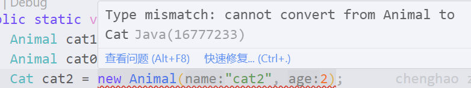

> src:https://github.com/jzm0817/javaLearning

此文档大部分地方没有完成代码，完整代码见 github

### 类与继承

0.simple example

> Animal.java  Cat.java

```java 
Animal cat1 = new Animal("cat0", 0);
Animal cat0 = new Cat("cat1", 1);
// Cat cat2 = new Animal("cat2", 2);
Cat cat3 = new Cat("cat3", 3);
```

Cat 类继承 Animal 类，可构造父类类型的子类对象


---

cat0、cat1 是 Animal 类型的对象，而 Animal 类中没有 bark 方法。


---

subclass 中的构造器(使用superclass 的构造器)
```java
public Cat(String name, Integer age){
    super(name, age);
    System.out.printf("from Cat para !!! \n");
}
```


重写 subclass 的构造器，主要利用了 superclass 中的两个方法，注释掉 subclass 中的调用 superclass 的构造器时，好像会隐式调用 superclass 中的无参构造器，而注释掉 superclass 中的无参构造器时
```java
public Cat(String name, Integer age){
    // super();
    super.setName(name);
    super.setAge(age);
    System.out.printf("from Cat para !!! \n");
}
```
会出现如下错误，似乎也说明了会 subclass 会隐式调用 superclass 中的无参构造器


----

static 方法
```java
// static method
Cat.bark();
Cat.bark2();
```
static 方法与类绑定，无需实例化也可以调用，而非 static 方法需要实例化后才能调用


---

subclass 与 superclass 中的方法，cat0 cat1 的类型是 Animal 类，因此没有定义 bark2 方法，subclass 中含有 superclass 中的属性与方法，因此可以利用 subclass 类的构造函数实例化 superclass 类型的对象，对象只有其本身 superclass 中的方法与属性。


修改 subclass 的构造器为，并在 subclass 中添加 color 属性。
```java
public Cat(String name, Integer age, String color){
        // super();
        super.setName(name);
        super.setAge(age);
        this.color = color;
        System.out.printf("from Cat para !!! \n");
    }
```

可以看到 cat1 中只有 superclass 的属性和方法


<font color=red>待看new、构造器</font>
